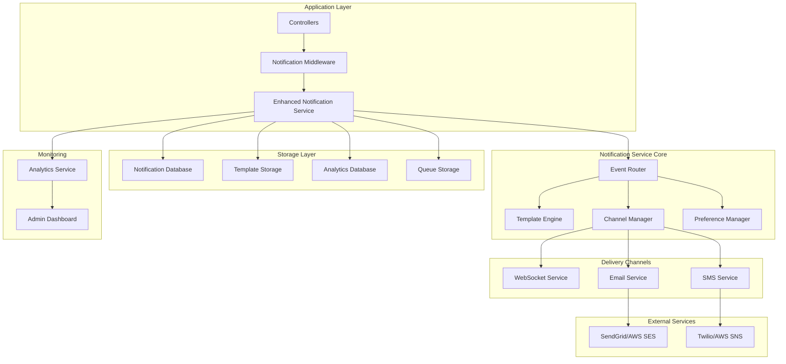

# Design Document

## Overview

The Advanced Notification System is designed to provide comprehensive, multi-channel notification capabilities across the healthcare platform. The system will integrate seamlessly with all existing backend controllers to automatically trigger notifications for relevant events, supporting real-time websocket notifications, email, and SMS delivery with intelligent routing and fallback mechanisms.

## Architecture

### High-Level Architecture



### System Components

1. **Notification Middleware**: Intercepts controller actions and triggers notifications
2. **Enhanced Notification Service**: Core service managing all notification logic
3. **Event Router**: Routes events to appropriate notification handlers
4. **Template Engine**: Manages and renders notification templates
5. **Channel Manager**: Handles multi-channel delivery with fallback logic
6. **Preference Manager**: Manages user notification preferences
7. **Analytics Service**: Tracks delivery metrics and user engagement

## Components and Interfaces

### 1. Enhanced Notification Service

```javascript
class EnhancedNotificationService {
  // Core notification creation and management
  async createNotification(notificationData)
  async sendNotification(userId, type, data, options)
  async sendBulkNotification(recipients, type, data, options)
  async sendRoleBasedNotification(role, type, data, options)
  
  // Channel-specific methods
  async sendEmail(userId, templateId, data, options)
  async sendSMS(userId, message, options)
  async sendWebSocketNotification(userId, notification)
  
  // Template and preference management
  async getNotificationTemplate(type, channel, userRole)
  async updateUserPreferences(userId, preferences)
  async getUserPreferences(userId)
  
  // Analytics and monitoring
  async getDeliveryStats(filters)
  async getEngagementMetrics(filters)
  async getSystemHealth()
}
```

### 2. Notification Middleware

```javascript
class NotificationMiddleware {
  // Automatic notification triggering
  static async afterCreate(model, data, context)
  static async afterUpdate(model, data, changes, context)
  static async afterDelete(model, data, context)
  
  // Event mapping
  static mapControllerEventToNotification(controller, action, data)
  static determineNotificationRecipients(event, data)
  static buildNotificationContext(event, data, user)
}
```

### 3. Multi-Channel Delivery System

```javascript
class ChannelManager {
  // Channel routing and delivery
  async deliverNotification(notification, channels, preferences)
  async deliverWithFallback(notification, primaryChannel, fallbackChannels)
  
  // Channel-specific delivery
  async deliverViaWebSocket(notification, userId)
  async deliverViaEmail(notification, userId, template)
  async deliverViaSMS(notification, userId, message)
  
  // Retry and error handling
  async retryFailedDelivery(notificationId, channel)
  async handleDeliveryFailure(notification, channel, error)
}
```

### 4. Template Engine

```javascript
class TemplateEngine {
  // Template management
  async getTemplate(type, channel, role, language)
  async renderTemplate(template, data, context)
  async validateTemplate(template)
  
  // Dynamic content generation
  async generateEmailHTML(template, data)
  async generateSMSMessage(template, data)
  async generateWebSocketPayload(template, data)
  
  // Personalization
  async personalizeContent(content, user, context)
  async applyUserPreferences(content, preferences)
}
```

### 5. External Service Integrations

#### Email Service Integration
```javascript
class EmailServiceManager {
  // Provider management
  async initializeProviders(config)
  async selectProvider(criteria)
  async failoverToBackup(primaryProvider, error)
  
  // Email delivery
  async sendEmail(recipient, subject, content, options)
  async sendBulkEmail(recipients, subject, content, options)
  async trackEmailDelivery(messageId)
  
  // Template and attachment handling
  async processEmailTemplate(template, data)
  async attachFiles(email, attachments)
  async validateEmailContent(content)
}
```

#### SMS Service Integration
```javascript
class SMSServiceManager {
  // Provider management
  async initializeProviders(config)
  async selectProvider(criteria)
  async failoverToBackup(primaryProvider, error)
  
  // SMS delivery
  async sendSMS(phoneNumber, message, options)
  async sendBulkSMS(recipients, message, options)
  async trackSMSDelivery(messageId)
  
  // Message optimization
  async optimizeMessageLength(message, maxLength)
  async validatePhoneNumber(phoneNumber)
  async formatInternationalNumber(phoneNumber, country)
}
```

## Data Models

### 1. Enhanced Notification Model

```javascript
const notificationSchema = {
  _id: ObjectId,
  type: String, // 'prescription_created', 'order_status_changed', etc.
  category: String, // 'medical', 'administrative', 'system', 'marketing'
  priority: String, // 'low', 'medium', 'high', 'critical', 'emergency'
  
  // Recipients
  recipients: [{
    userId: ObjectId,
    userRole: String,
    deliveryChannels: [String], // ['websocket', 'email', 'sms']
    deliveryStatus: {
      websocket: { status: String, deliveredAt: Date, error: String },
      email: { status: String, deliveredAt: Date, messageId: String, error: String },
      sms: { status: String, deliveredAt: Date, messageId: String, error: String }
    },
    readAt: Date,
    actionTaken: { action: String, takenAt: Date }
  }],
  
  // Content
  content: {
    title: String,
    message: String,
    actionUrl: String,
    actionText: String,
    metadata: Object
  },
  
  // Template information
  templateId: String,
  templateVersion: String,
  
  // Context and data
  contextData: Object, // Original data used to generate notification
  relatedEntities: [{
    entityType: String, // 'prescription', 'order', 'appointment', etc.
    entityId: ObjectId
  }],
  
  // Scheduling and expiry
  scheduledFor: Date,
  expiresAt: Date,
  
  // Analytics
  analytics: {
    totalRecipients: Number,
    deliveredCount: Number,
    readCount: Number,
    actionCount: Number,
    bounceCount: Number,
    unsubscribeCount: Number
  },
  
  // System metadata
  createdBy: ObjectId,
  createdAt: Date,
  updatedAt: Date,
  retryCount: Number,
  lastRetryAt: Date
}
```

### 2. Notification Template Model

```javascript
const notificationTemplateSchema = {
  _id: ObjectId,
  name: String,
  type: String, // 'prescription_created', 'order_confirmed', etc.
  category: String,
  
  // Template variants
  variants: [{
    channel: String, // 'websocket', 'email', 'sms'
    userRole: String, // 'patient', 'doctor', 'pharmacy', 'admin'
    language: String,
    
    // Content templates
    subject: String, // For email
    title: String, // For websocket/push
    body: String, // Template with placeholders
    htmlBody: String, // For email HTML version
    
    // Styling and formatting
    styling: {
      primaryColor: String,
      logoUrl: String,
      footerText: String
    },
    
    // Action buttons
    actions: [{
      text: String,
      url: String,
      style: String // 'primary', 'secondary', 'danger'
    }]
  }],
  
  // Template metadata
  version: String,
  isActive: Boolean,
  createdBy: ObjectId,
  createdAt: Date,
  updatedAt: Date,
  
  // Usage analytics
  usage: {
    totalSent: Number,
    lastUsed: Date,
    averageEngagement: Number
  }
}
```

### 3. User Notification Preferences Model

```javascript
const notificationPreferencesSchema = {
  userId: ObjectId,
  
  // Global preferences
  globalSettings: {
    enabled: Boolean,
    quietHours: {
      enabled: Boolean,
      startTime: String, // "22:00"
      endTime: String, // "08:00"
      timezone: String
    },
    frequency: String // 'immediate', 'hourly', 'daily', 'weekly'
  },
  
  // Channel preferences
  channels: {
    websocket: { enabled: Boolean },
    email: { 
      enabled: Boolean,
      frequency: String, // 'immediate', 'digest'
      digestTime: String // "09:00"
    },
    sms: { 
      enabled: Boolean,
      emergencyOnly: Boolean
    }
  },
  
  // Category preferences
  categories: {
    medical: {
      enabled: Boolean,
      channels: [String],
      priority: String // 'all', 'high', 'critical'
    },
    administrative: {
      enabled: Boolean,
      channels: [String],
      priority: String
    },
    system: {
      enabled: Boolean,
      channels: [String],
      priority: String
    },
    marketing: {
      enabled: Boolean,
      channels: [String],
      priority: String
    }
  },
  
  // Specific notification type preferences
  notificationTypes: {
    prescription_created: { enabled: Boolean, channels: [String] },
    order_status_changed: { enabled: Boolean, channels: [String] },
    appointment_reminder: { enabled: Boolean, channels: [String] },
    payment_processed: { enabled: Boolean, channels: [String] },
    // ... more specific types
  },
  
  // Contact information
  contactInfo: {
    email: String,
    phone: String,
    preferredLanguage: String
  },
  
  updatedAt: Date
}
```

### 4. Notification Analytics Model

```javascript
const notificationAnalyticsSchema = {
  _id: ObjectId,
  date: Date, // Daily aggregation
  
  // Overall metrics
  totalSent: Number,
  totalDelivered: Number,
  totalRead: Number,
  totalActioned: Number,
  totalFailed: Number,
  
  // Channel breakdown
  channelMetrics: {
    websocket: { sent: Number, delivered: Number, read: Number },
    email: { sent: Number, delivered: Number, opened: Number, clicked: Number, bounced: Number },
    sms: { sent: Number, delivered: Number, failed: Number }
  },
  
  // User role breakdown
  roleMetrics: {
    patient: { sent: Number, delivered: Number, engagement: Number },
    doctor: { sent: Number, delivered: Number, engagement: Number },
    pharmacy: { sent: Number, delivered: Number, engagement: Number },
    admin: { sent: Number, delivered: Number, engagement: Number }
  },
  
  // Notification type breakdown
  typeMetrics: [{
    type: String,
    sent: Number,
    delivered: Number,
    engagement: Number,
    averageResponseTime: Number
  }],
  
  // Performance metrics
  performance: {
    averageDeliveryTime: Number, // milliseconds
    failureRate: Number, // percentage
    retryRate: Number // percentage
  }
}
```

## Error Handling

### 1. Delivery Failure Handling

```javascript
class DeliveryErrorHandler {
  async handleWebSocketFailure(notification, error) {
    // Log error and attempt email fallback
    await this.logDeliveryFailure('websocket', notification.id, error);
    return await this.attemptFallbackDelivery(notification, 'email');
  }
  
  async handleEmailFailure(notification, error) {
    // Categorize error (temporary vs permanent)
    if (this.isTemporaryError(error)) {
      return await this.scheduleRetry(notification, 'email');
    } else {
      await this.logPermanentFailure('email', notification.id, error);
      return await this.attemptFallbackDelivery(notification, 'sms');
    }
  }
  
  async handleSMSFailure(notification, error) {
    // Log failure and mark as undeliverable
    await this.logDeliveryFailure('sms', notification.id, error);
    await this.markAsUndeliverable(notification);
    
    // Alert administrators for critical notifications
    if (notification.priority === 'critical' || notification.priority === 'emergency') {
      await this.alertAdministrators(notification, error);
    }
  }
}
```

### 2. Template Error Handling

```javascript
class TemplateErrorHandler {
  async handleTemplateNotFound(type, channel, role) {
    // Use fallback template
    const fallbackTemplate = await this.getFallbackTemplate(channel, role);
    await this.logTemplateError('template_not_found', type, channel, role);
    return fallbackTemplate;
  }
  
  async handleRenderingError(template, data, error) {
    // Attempt with sanitized data
    const sanitizedData = this.sanitizeTemplateData(data);
    try {
      return await this.renderTemplate(template, sanitizedData);
    } catch (retryError) {
      // Use minimal template
      await this.logTemplateError('rendering_failed', template.id, error);
      return await this.getMinimalTemplate(template.channel, template.role);
    }
  }
}
```

### 3. External Service Error Handling

```javascript
class ExternalServiceErrorHandler {
  async handleProviderFailure(provider, service, error) {
    // Log the failure
    await this.logProviderFailure(provider, service, error);
    
    // Attempt failover to backup provider
    const backupProvider = await this.getBackupProvider(service);
    if (backupProvider) {
      return await this.failoverToProvider(backupProvider, service);
    }
    
    // No backup available - queue for retry
    return await this.queueForRetry(service, error);
  }
  
  async handleRateLimitExceeded(provider, service) {
    // Switch to backup provider immediately
    const backupProvider = await this.getBackupProvider(service);
    if (backupProvider) {
      return await this.failoverToProvider(backupProvider, service);
    }
    
    // Calculate retry delay based on rate limit reset time
    const retryDelay = await this.calculateRateLimitDelay(provider);
    return await this.scheduleRetryAfterDelay(service, retryDelay);
  }
}
```

## Testing Strategy

### 1. Unit Testing

- **Notification Service Tests**: Test core notification creation, routing, and delivery logic
- **Template Engine Tests**: Test template rendering with various data inputs and edge cases
- **Channel Manager Tests**: Test multi-channel delivery and fallback mechanisms
- **Preference Manager Tests**: Test user preference handling and validation
- **External Service Tests**: Mock external services and test integration logic

### 2. Integration Testing

- **Controller Integration**: Test notification triggering from all controller actions
- **Database Integration**: Test notification persistence and retrieval
- **External Service Integration**: Test actual email and SMS delivery with test accounts
- **WebSocket Integration**: Test real-time notification delivery
- **Template Integration**: Test end-to-end template rendering and delivery

### 3. End-to-End Testing

- **User Journey Tests**: Test complete notification flows for different user scenarios
- **Multi-Channel Tests**: Test notifications delivered across all channels simultaneously
- **Preference Tests**: Test notification behavior with various user preference configurations
- **Failure Recovery Tests**: Test system behavior during external service outages
- **Performance Tests**: Test system performance under high notification volumes

### 4. Load Testing

- **Volume Testing**: Test system with high volumes of simultaneous notifications
- **Concurrent User Testing**: Test notification delivery to many users simultaneously
- **External Service Limits**: Test behavior when approaching external service rate limits
- **Database Performance**: Test notification storage and retrieval under load
- **Memory Usage**: Test system memory usage during peak notification periods

### 5. Security Testing

- **Data Sanitization**: Test template rendering with malicious input data
- **Access Control**: Test that users only receive notifications they're authorized to see
- **PII Protection**: Test that sensitive information is properly handled in notifications
- **External Service Security**: Test secure communication with external services
- **Audit Trail**: Test that all notification activities are properly logged

### 6. Monitoring and Alerting Tests

- **Delivery Monitoring**: Test that delivery failures are properly detected and reported
- **Performance Monitoring**: Test that performance metrics are accurately collected
- **Alert Generation**: Test that system alerts are triggered for critical issues
- **Dashboard Accuracy**: Test that admin dashboard displays accurate real-time data
- **Health Check Tests**: Test system health monitoring and reporting

## Performance Considerations

### 1. Scalability Design

- **Horizontal Scaling**: Design services to scale across multiple instances
- **Queue Management**: Use message queues for handling high-volume notifications
- **Database Optimization**: Implement proper indexing and query optimization
- **Caching Strategy**: Cache frequently accessed templates and user preferences
- **Load Balancing**: Distribute notification processing across multiple workers

### 2. Optimization Strategies

- **Batch Processing**: Group similar notifications for efficient processing
- **Template Caching**: Cache rendered templates to reduce processing time
- **Connection Pooling**: Maintain persistent connections to external services
- **Async Processing**: Process notifications asynchronously to avoid blocking operations
- **Resource Management**: Monitor and manage system resources effectively

This design provides a comprehensive foundation for implementing the advanced notification system with all the required features while maintaining scalability, reliability, and performance.