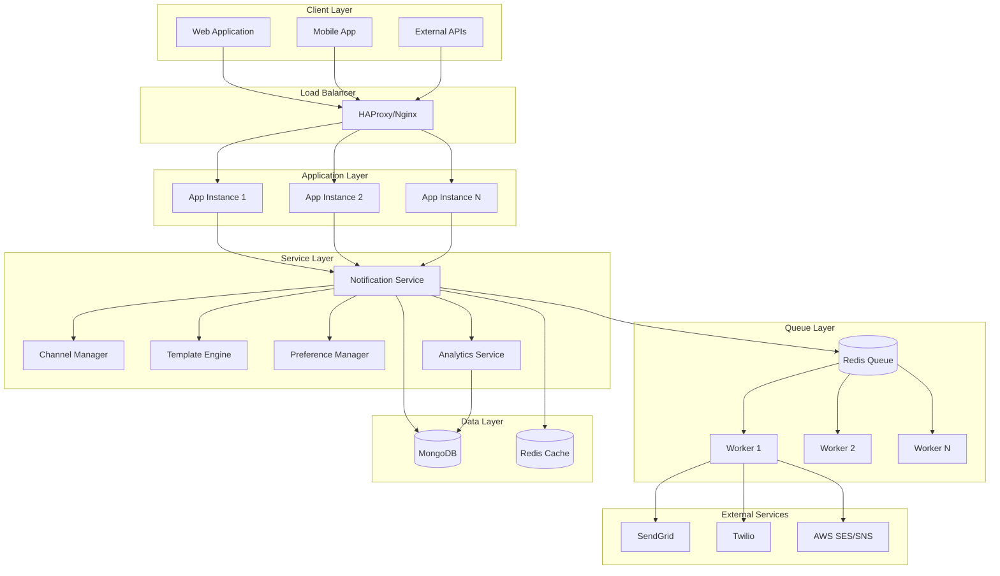
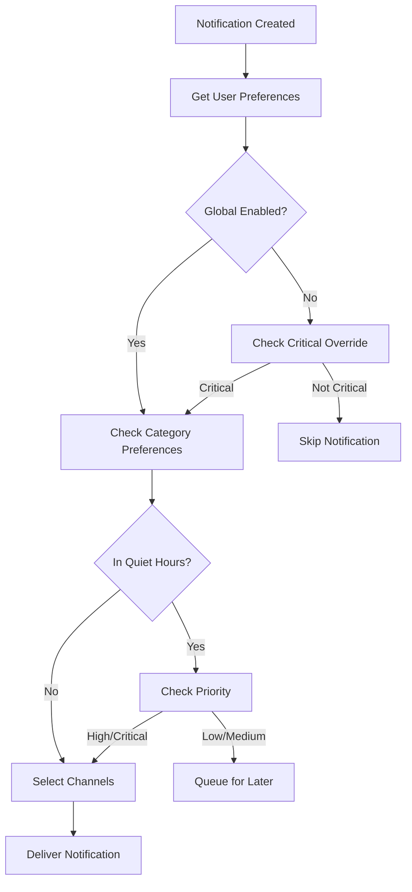
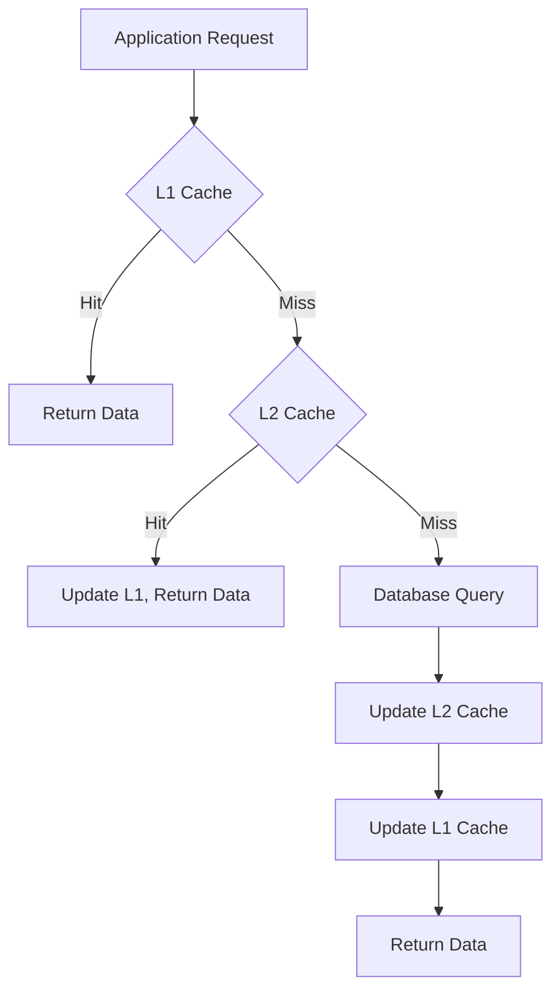
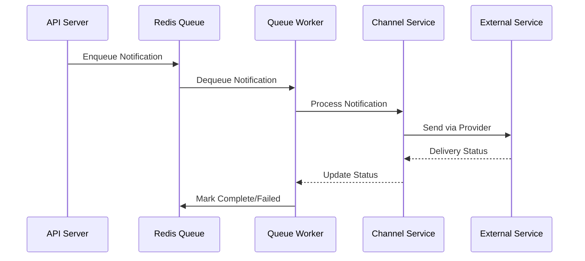

# System Architecture Documentation

## Overview

The Advanced Notification System is built using a microservices-oriented architecture that provides scalable, reliable, and maintainable notification delivery across multiple channels. This document outlines the system architecture, component interactions, and design decisions.

## Architecture Principles

### Core Principles

1. **Scalability**: Horizontal scaling capability to handle growing notification volumes
2. **Reliability**: Fault-tolerant design with fallback mechanisms and retry logic
3. **Performance**: Optimized for high-throughput notification processing
4. **Maintainability**: Modular design with clear separation of concerns
5. **Security**: End-to-end security with encryption and access controls
6. **Observability**: Comprehensive monitoring and logging capabilities

### Design Patterns

- **Event-Driven Architecture**: Asynchronous processing using event queues
- **Circuit Breaker**: Protection against external service failures
- **Retry Pattern**: Exponential backoff for failed operations
- **Bulkhead Pattern**: Isolation of critical resources
- **Observer Pattern**: Real-time notification delivery via WebSockets

## System Components

### High-Level Architecture



### Component Details

#### 1. Enhanced Notification Service (Core)

**Purpose**: Central orchestrator for all notification operations

**Responsibilities**:
- Notification creation and validation
- Recipient determination and routing
- Channel selection based on preferences
- Queue management and processing
- Analytics and monitoring

**Key Classes**:
```javascript
class EnhancedNotificationService {
  async createNotification(data)
  async sendNotification(userId, type, data, options)
  async sendBulkNotification(recipients, type, data)
  async sendRoleBasedNotification(role, type, data)
  async processNotificationQueue()
  async handleDeliveryFailure(notification, error)
}
```

**Interfaces**:
- REST API endpoints for notification management
- WebSocket connections for real-time delivery
- Queue interfaces for asynchronous processing
- Database interfaces for persistence

#### 2. Channel Manager

**Purpose**: Manages multi-channel delivery with intelligent routing

**Responsibilities**:
- Channel-specific delivery logic
- Fallback mechanism implementation
- Provider selection and failover
- Delivery status tracking

**Architecture**:
```javascript
class ChannelManager {
  constructor() {
    this.channels = {
      websocket: new WebSocketChannel(),
      email: new EmailChannel(),
      sms: new SMSChannel()
    };
  }
  
  async deliverNotification(notification, channels) {
    const results = await Promise.allSettled(
      channels.map(channel => this.channels[channel].deliver(notification))
    );
    return this.processDeliveryResults(results);
  }
}
```

**Channel Implementations**:
- **WebSocketChannel**: Real-time delivery via Socket.IO
- **EmailChannel**: Email delivery via SendGrid/AWS SES
- **SMSChannel**: SMS delivery via Twilio/AWS SNS

#### 3. Template Engine

**Purpose**: Dynamic content generation and template management

**Responsibilities**:
- Template storage and versioning
- Dynamic content rendering
- Multi-language support
- Template validation and testing

**Template Structure**:
```javascript
const templateSchema = {
  name: String,
  type: String, // notification type
  variants: [{
    channel: String, // websocket, email, sms
    userRole: String, // patient, doctor, pharmacy, admin
    language: String,
    subject: String,
    body: String, // Handlebars template
    htmlBody: String, // HTML version for email
    actions: [{ text: String, url: String }]
  }]
};
```

#### 4. Preference Manager

**Purpose**: User notification preference management and evaluation

**Responsibilities**:
- Preference storage and retrieval
- Channel selection based on preferences
- Quiet hours enforcement
- Critical notification override logic

**Preference Evaluation Flow**:


#### 5. Analytics Service

**Purpose**: Comprehensive analytics and monitoring

**Responsibilities**:
- Delivery metrics collection
- User engagement tracking
- Performance monitoring
- Real-time dashboard data

**Metrics Collected**:
- Delivery rates by channel and type
- User engagement metrics (open, click, action rates)
- System performance metrics (response times, error rates)
- Business metrics (notification volume, user growth)

## Data Architecture

### Database Design

#### MongoDB Collections

**1. Notifications Collection**
```javascript
{
  _id: ObjectId,
  type: String,
  category: String,
  priority: String,
  recipients: [{
    userId: ObjectId,
    userRole: String,
    deliveryChannels: [String],
    deliveryStatus: {
      websocket: { status: String, deliveredAt: Date },
      email: { status: String, messageId: String, deliveredAt: Date },
      sms: { status: String, messageId: String, deliveredAt: Date }
    },
    readAt: Date,
    actionTaken: { action: String, takenAt: Date }
  }],
  content: {
    title: String,
    message: String,
    actionUrl: String,
    metadata: Object
  },
  templateId: String,
  contextData: Object,
  scheduledFor: Date,
  expiresAt: Date,
  createdAt: Date,
  updatedAt: Date
}
```

**2. User Notification Preferences**
```javascript
{
  userId: ObjectId,
  globalSettings: {
    enabled: Boolean,
    quietHours: { enabled: Boolean, startTime: String, endTime: String },
    frequency: String
  },
  channels: {
    websocket: { enabled: Boolean },
    email: { enabled: Boolean, frequency: String },
    sms: { enabled: Boolean, emergencyOnly: Boolean }
  },
  categories: {
    medical: { enabled: Boolean, channels: [String], priority: String },
    administrative: { enabled: Boolean, channels: [String], priority: String }
  },
  updatedAt: Date
}
```

**3. Notification Templates**
```javascript
{
  _id: ObjectId,
  name: String,
  type: String,
  category: String,
  variants: [{
    channel: String,
    userRole: String,
    language: String,
    subject: String,
    body: String,
    htmlBody: String,
    actions: [{ text: String, url: String }]
  }],
  version: String,
  isActive: Boolean,
  createdAt: Date,
  usage: { totalSent: Number, lastUsed: Date }
}
```

#### Redis Data Structures

**1. Notification Queues**
```
notification_queue: List of pending notifications
notification_processing: Set of currently processing notifications
notification_failed: List of failed notifications for retry
notification_completed: List of completed notifications (temporary)
```

**2. Cache Keys**
```
user:preferences:{userId}: User notification preferences
template:{type}:{channel}:{role}: Cached templates
analytics:daily:{date}: Daily analytics data
session:{sessionId}: WebSocket session data
```

### Indexing Strategy

**MongoDB Indexes**:
```javascript
// Notifications collection
db.notifications.createIndex({ "recipients.userId": 1, "createdAt": -1 });
db.notifications.createIndex({ "type": 1, "scheduledFor": 1 });
db.notifications.createIndex({ "status": 1, "createdAt": -1 });
db.notifications.createIndex({ "expiresAt": 1 }, { expireAfterSeconds: 0 });

// User preferences collection
db.usernotificationpreferences.createIndex({ "userId": 1 }, { unique: true });

// Templates collection
db.notificationtemplates.createIndex({ "type": 1, "isActive": 1 });
db.notificationtemplates.createIndex({ "name": 1, "version": 1 });

// Analytics collection
db.notificationanalytics.createIndex({ "date": 1 });
db.notificationanalytics.createIndex({ "type": 1, "date": 1 });
```

## Security Architecture

### Authentication and Authorization

**JWT Token Structure**:
```javascript
{
  "userId": "user_123",
  "role": "patient",
  "permissions": ["read:notifications", "write:preferences"],
  "iat": 1642694400,
  "exp": 1642780800
}
```

**Role-Based Access Control**:
```javascript
const permissions = {
  patient: ['read:own_notifications', 'write:own_preferences'],
  doctor: ['read:patient_notifications', 'write:patient_notifications'],
  pharmacy: ['read:pharmacy_notifications', 'write:pharmacy_responses'],
  admin: ['read:all_notifications', 'write:system_notifications', 'manage:templates']
};
```

### Data Encryption

**At Rest**:
- MongoDB encryption using WiredTiger encryption
- Redis encryption using TLS
- File system encryption for logs and backups

**In Transit**:
- TLS 1.3 for all HTTP/HTTPS communications
- WebSocket Secure (WSS) for real-time connections
- Encrypted connections to external services

**Application Level**:
```javascript
const crypto = require('crypto');

class NotificationEncryption {
  static encrypt(data, key) {
    const cipher = crypto.createCipher('aes-256-gcm', key);
    let encrypted = cipher.update(JSON.stringify(data), 'utf8', 'hex');
    encrypted += cipher.final('hex');
    return encrypted;
  }
  
  static decrypt(encryptedData, key) {
    const decipher = crypto.createDecipher('aes-256-gcm', key);
    let decrypted = decipher.update(encryptedData, 'hex', 'utf8');
    decrypted += decipher.final('utf8');
    return JSON.parse(decrypted);
  }
}
```

## Performance Architecture

### Scalability Design

**Horizontal Scaling**:
- Stateless application instances
- Load balancing with session affinity for WebSockets
- Database sharding by user ID
- Queue partitioning for parallel processing

**Vertical Scaling**:
- CPU optimization for template rendering
- Memory optimization for queue processing
- I/O optimization for database operations

### Caching Strategy

**Multi-Level Caching**:


**Cache Levels**:
1. **L1 (Application Memory)**: Frequently accessed templates and preferences
2. **L2 (Redis)**: User sessions, notification queues, analytics data
3. **Database**: Persistent storage for all data

### Queue Architecture

**Queue Processing Flow**:


**Queue Management**:
- Priority queues for different notification types
- Dead letter queues for failed notifications
- Rate limiting per external service
- Batch processing for efficiency

## Monitoring Architecture

### Observability Stack

**Metrics Collection**:
- Prometheus for metrics collection
- Grafana for visualization
- Custom metrics for business KPIs

**Logging**:
- Structured logging with Winston
- Centralized log aggregation with ELK stack
- Log correlation with trace IDs

**Tracing**:
- Distributed tracing with Jaeger
- Request correlation across services
- Performance bottleneck identification

### Health Checks

**Application Health**:
```javascript
class HealthChecker {
  async checkHealth() {
    const checks = await Promise.allSettled([
      this.checkDatabase(),
      this.checkRedis(),
      this.checkExternalServices(),
      this.checkQueues()
    ]);
    
    return {
      status: checks.every(check => check.status === 'fulfilled') ? 'healthy' : 'unhealthy',
      checks: checks.map(check => ({
        name: check.name,
        status: check.status,
        details: check.value || check.reason
      })),
      timestamp: new Date().toISOString()
    };
  }
}
```

## Deployment Architecture

### Container Architecture

**Docker Configuration**:
```dockerfile
FROM node:18-alpine

WORKDIR /app

# Install dependencies
COPY package*.json ./
RUN npm ci --only=production

# Copy application code
COPY . .

# Security: Create non-root user
RUN addgroup -g 1001 -S nodejs && \
    adduser -S nodejs -u 1001
USER nodejs

EXPOSE 5000

HEALTHCHECK --interval=30s --timeout=3s --start-period=5s --retries=3 \
  CMD curl -f http://localhost:5000/health || exit 1

CMD ["npm", "start"]
```

**Kubernetes Deployment**:
```yaml
apiVersion: apps/v1
kind: Deployment
metadata:
  name: notification-service
spec:
  replicas: 3
  strategy:
    type: RollingUpdate
    rollingUpdate:
      maxSurge: 1
      maxUnavailable: 0
  selector:
    matchLabels:
      app: notification-service
  template:
    metadata:
      labels:
        app: notification-service
    spec:
      containers:
      - name: notification-service
        image: notification-service:latest
        ports:
        - containerPort: 5000
        resources:
          requests:
            memory: "512Mi"
            cpu: "250m"
          limits:
            memory: "1Gi"
            cpu: "500m"
        livenessProbe:
          httpGet:
            path: /health
            port: 5000
          initialDelaySeconds: 30
          periodSeconds: 10
        readinessProbe:
          httpGet:
            path: /ready
            port: 5000
          initialDelaySeconds: 5
          periodSeconds: 5
```

### Infrastructure as Code

**Terraform Configuration**:
```hcl
resource "aws_ecs_cluster" "notification_cluster" {
  name = "notification-service"
  
  setting {
    name  = "containerInsights"
    value = "enabled"
  }
}

resource "aws_ecs_service" "notification_service" {
  name            = "notification-service"
  cluster         = aws_ecs_cluster.notification_cluster.id
  task_definition = aws_ecs_task_definition.notification_task.arn
  desired_count   = 3
  
  load_balancer {
    target_group_arn = aws_lb_target_group.notification_tg.arn
    container_name   = "notification-service"
    container_port   = 5000
  }
  
  deployment_configuration {
    maximum_percent         = 200
    minimum_healthy_percent = 100
  }
}
```

## Disaster Recovery Architecture

### Backup Strategy

**Multi-Tier Backup**:
1. **Real-time**: Database replication across availability zones
2. **Hourly**: Incremental backups to cloud storage
3. **Daily**: Full system backups with retention policy
4. **Weekly**: Cross-region backup replication

**Recovery Time Objectives**:
- **RTO**: 15 minutes for critical services
- **RPO**: 1 hour maximum data loss
- **Availability**: 99.9% uptime SLA

### Failover Mechanisms

**Database Failover**:
```javascript
const mongoose = require('mongoose');

const mongoOptions = {
  replicaSet: 'rs0',
  readPreference: 'secondaryPreferred',
  maxPoolSize: 10,
  serverSelectionTimeoutMS: 5000,
  heartbeatFrequencyMS: 2000
};

mongoose.connect(process.env.MONGODB_URI, mongoOptions);

mongoose.connection.on('error', (err) => {
  console.error('MongoDB connection error:', err);
  // Implement failover logic
});
```

**Service Failover**:
- Load balancer health checks
- Automatic instance replacement
- Circuit breaker pattern for external services
- Graceful degradation of non-critical features

This architecture documentation provides a comprehensive overview of the system design, enabling developers and operators to understand, maintain, and scale the notification system effectively.