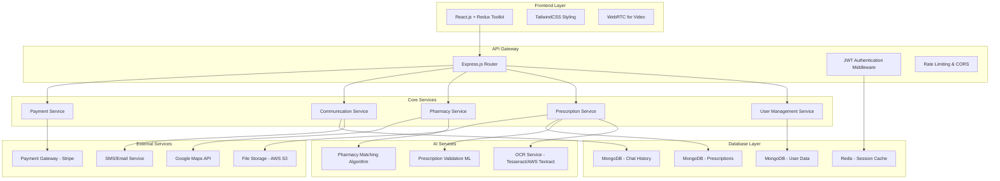

# Design Document

## File Structure

The following is the full folder and file layout for the Frontend and Backend applications:

### Frontend
```bash
frontend/
├── public/
│   └── index.html
├── src/
│   ├── api/
│   │   ├── apiClient.js
│   │   └── openapi/
│   ├── app/
│   │   ├── App.jsx
│   │   └── AppRoutes.jsx
│   ├── components/
│   │   ├── common/
│   │   ├── layout/
│   │   └── widgets/
│   ├── features/
│   │   ├── auth/
│   │   ├── user/
│   │   ├── prescription/
│   │   ├── pharmacy/
│   │   ├── chat/
│   │   ├── payment/
│   │   └── notification/
│   ├── hooks/
│   ├── pages/
│   ├── store/
│   │   ├── index.js
│   │   └── slices/
│   ├── styles/
│   │   └── index.css
│   ├── utils/
│   ├── main.jsx
│   └── index.css
├── tests/
│   ├── unit/
│   ├── integration/
│   └── e2e/
├── babel.config.js
├── eslint.config.js
├── jest.config.js
├── jest.setup.js
├── package.json
├── postcss.config.js
├── postcss.config.mjs
├── tailwind.config.js
├── vite.config.js
└── README.md
```

### Backend
```bash
backend/
├── babel.config.json
├── Dockerfile
├── eng.traineddata
├── INSTALLATION.md
├── package.json
├── server.js
├── server_minimal.js
├── TASK_6_COMPLETION.md
├── src/
│   ├── config/
│   ├── controllers/
│   ├── middleware/
│   ├── models/
│   ├── routes/
│   ├── services/
│   ├── templates/
│   └── utils/
└── uploads/
```

## Overview

The Unified Patient-Pharmacy-Practitioner System is a full-stack web application built on the MERN stack (MongoDB, Express.js, React.js, Node.js) with integrated AI services for prescription processing, pharmacy matching, and validation. The system uses a microservices architecture with separate services for core application logic, AI processing, real-time communication, and payment processing.

## Architecture

### High-Level Architecture



### Technology Stack Details

- **Frontend**: React.js 18+ with Redux Toolkit for state management, TailwindCSS for styling, JavaScript (JSX)
- **Backend**: Node.js with Express.js framework, JWT for authentication, JavaScript with MVC architecture
- **Database**: MongoDB for primary data storage, Redis for caching and sessions
- **AI/ML**: Python microservices using Flask/FastAPI, TensorFlow for ML models, Tesseract OCR
- **Real-time Communication**: Socket.io for chat, WebRTC for video consultations
- **External APIs**: Google Maps API, Stripe payment gateway, AWS S3 for file storage
- **Deployment**: Docker containers, PM2 for process management, AWS/GCP for hosting

## Components and Interfaces

### Frontend Components

#### Patient Portal Components
```javascript
// Core patient components structure
PatientDashboard/
├── ProfileManagement/
│   ├── ProfileForm.jsx
│   ├── HealthHistoryForm.jsx
│   └── TwoFactorAuth.jsx
├── PrescriptionManagement/
│   ├── PrescriptionUpload.jsx
│   ├── PrescriptionViewer.jsx
│   └── OrderHistory.jsx
├── PharmacyDiscovery/
│   ├── PharmacyMap.jsx
│   ├── PharmacyList.jsx
│   └── PharmacyDetails.jsx
├── Communication/
│   ├── ChatInterface.jsx
│   ├── VideoConsultation.jsx
│   └── MessageThread.jsx
└── Payment/
    ├── PaymentForm.jsx
    ├── PaymentHistory.jsx
    └── RefillReminders.jsx
```

#### Pharmacy Portal Components
```javascript
// Core pharmacy components structure
PharmacyDashboard/
├── Registration/
│   ├── PharmacyRegistrationForm.jsx
│   ├── LicenseUpload.jsx
│   └── IntakeForm.jsx
├── PrescriptionManagement/
│   ├── PrescriptionNotifications.jsx
│   ├── PrescriptionValidator.jsx
│   └── FulfillmentTracker.jsx
├── Communication/
│   ├── PatientChat.jsx
│   ├── VideoConsultRoom.jsx
│   └── ConsultationHistory.jsx
└── Inventory/
    ├── InventoryManager.jsx
    └── AutoRefillSetup.jsx
```

#### Admin Panel Components
```javascript
// Admin panel components structure
AdminDashboard/
├── UserManagement/
│   ├── UserList.jsx
│   ├── PharmacyApprovals.jsx
│   └── UserDetails.jsx
├── SystemMonitoring/
│   ├── ActiveSessions.jsx
│   ├── TransactionLogs.jsx
│   └── SystemMetrics.jsx
└── Reports/
    ├── PrescriptionTrends.jsx
    ├── FulfillmentRates.jsx
    └── PlatformEarnings.jsx
```

### Backend API Structure

#### Core API Endpoints
```javascript
// API route structure with controllers
/api/v1/
├── auth/
│   ├── POST /register (authController.register)
│   ├── POST /login (authController.login)
│   ├── POST /verify-2fa (authController.verify2FA)
│   └── POST /refresh-token (authController.refreshToken)
├── users/
│   ├── GET /profile (userController.getProfile)
│   ├── PUT /profile (userController.updateProfile)
│   └── POST /upload-avatar (userController.uploadAvatar)
├── prescriptions/
│   ├── POST /upload (prescriptionController.upload)
│   ├── GET /:id (prescriptionController.getById)
│   ├── PUT /:id/status (prescriptionController.updateStatus)
│   └── GET /history (prescriptionController.getHistory)
├── pharmacies/
│   ├── POST /register (pharmacyController.register)
│   ├── GET /nearby (pharmacyController.getNearby)
│   ├── POST /:id/accept-prescription (pharmacyController.acceptPrescription)
│   └── PUT /:id/update-status (pharmacyController.updateStatus)
├── communication/
│   ├── GET /chats (communicationController.getChats)
│   ├── POST /chats/:id/messages (communicationController.sendMessage)
│   └── POST /video-session/initiate (communicationController.initiateVideoSession)
├── payments/
│   ├── POST /create-payment-intent (paymentController.createPaymentIntent)
│   ├── POST /confirm-payment (paymentController.confirmPayment)
│   └── GET /transaction-history (paymentController.getTransactionHistory)
└── admin/
    ├── GET /users (adminController.getUsers)
    ├── PUT /pharmacy/:id/approve (adminController.approvePharmacy)
    └── GET /system-metrics (adminController.getSystemMetrics)
```

#### Backend Folder Structure
```javascript
// Backend project structure
backend/
├── controllers/
│   ├── authController.js
│   ├── userController.js
│   ├── prescriptionController.js
│   ├── pharmacyController.js
│   ├── communicationController.js
│   ├── paymentController.js
│   └── adminController.js
├── routes/
│   ├── authRoutes.js
│   ├── userRoutes.js
│   ├── prescriptionRoutes.js
│   ├── pharmacyRoutes.js
│   ├── communicationRoutes.js
│   ├── paymentRoutes.js
│   └── adminRoutes.js
├── models/
│   ├── User.js
│   ├── Pharmacy.js
│   ├── Prescription.js
│   ├── ChatMessage.js
│   ├── VideoConsultation.js
│   ├── Payment.js
│   └── Notification.js
├── services/
│   ├── authService.js
│   ├── ocrService.js
│   ├── pharmacyMatchingService.js
│   ├── paymentService.js
│   └── notificationService.js
├── middleware/
│   ├── auth.js
│   ├── validation.js
│   ├── upload.js
│   └── errorHandler.js
└── utils/
    ├── database.js
    ├── encryption.js
    └── helpers.js
```

### Database Schema Design

#### User Collections
```javascript
// Users Collection
{
  _id: ObjectId,
  email: String,
  password: String, // bcrypt hashed
  role: String, // 'patient', 'pharmacy', 'admin'
  profile: {
    name: String,
    phone: String,
    address: Object,
    healthHistory: Array,
    twoFactorEnabled: Boolean
  },
  createdAt: Date,
  updatedAt: Date,
  isActive: Boolean
}

// Pharmacies Collection
{
  _id: ObjectId,
  userId: ObjectId, // Reference to Users collection
  pharmacyName: String,
  licenseNumber: String,
  registeredPharmacist: String,
  location: {
    type: "Point",
    coordinates: [longitude, latitude]
  },
  contactInfo: Object,
  operatingHours: Object,
  services: Array,
  documents: Array, // License files
  approvalStatus: String, // 'pending', 'approved', 'rejected'
  rating: Number,
  createdAt: Date
}

// Prescriptions Collection
{
  _id: ObjectId,
  patientId: ObjectId,
  pharmacyId: ObjectId,
  originalFile: {
    filename: String,
    s3Key: String,
    fileType: String
  },
  ocrData: {
    extractedText: String,
    medications: Array,
    confidence: Number,
    processingStatus: String
  },
  validationResults: {
    isValid: Boolean,
    flags: Array,
    aiConfidence: Number
  },
  status: String, // 'uploaded', 'processing', 'accepted', 'fulfilled'
  fulfillmentDetails: Object,
  paymentInfo: Object,
  createdAt: Date,
  updatedAt: Date
}

// Chat Messages Collection
{
  _id: ObjectId,
  chatId: String,
  senderId: ObjectId,
  receiverId: ObjectId,
  message: String,
  messageType: String, // 'text', 'image', 'file'
  timestamp: Date,
  isRead: Boolean
}
```

## Data Models

### Core Data Models

#### User Model
```javascript
// User data structure
const User = {
  id: String,
  email: String,
  role: String, // 'patient' | 'pharmacy' | 'admin'
  profile: {
    name: String,
    phone: String,
    address: Object,
    healthHistory: Array,
    twoFactorEnabled: Boolean
  },
  isActive: Boolean,
  createdAt: Date,
  updatedAt: Date
}
```

#### Prescription Model
```javascript
// Prescription data structure
const Prescription = {
  id: String,
  patientId: String,
  pharmacyId: String,
  originalFile: {
    filename: String,
    s3Key: String,
    url: String,
    fileType: String
  },
  ocrData: {
    extractedText: String,
    medications: Array,
    confidence: Number,
    processingStatus: String // 'pending' | 'completed' | 'failed'
  },
  validationResults: {
    isValid: Boolean,
    flags: Array,
    aiConfidence: Number,
    reviewRequired: Boolean
  },
  status: String,
  fulfillmentDetails: Object,
  paymentInfo: Object,
  createdAt: Date,
  updatedAt: Date
}
```

#### Pharmacy Model
```javascript
// Pharmacy data structure
const Pharmacy = {
  id: String,
  userId: String,
  pharmacyName: String,
  licenseNumber: String,
  registeredPharmacist: String,
  location: {
    type: "Point",
    coordinates: Array // [longitude, latitude]
  },
  contactInfo: Object,
  operatingHours: Object,
  services: Array,
  documents: Array,
  approvalStatus: String, // 'pending' | 'approved' | 'rejected'
  rating: Number,
  createdAt: Date
}
```

### AI Service Models

#### OCR Processing Pipeline
```python
# OCR Service Data Flow
class OCRProcessor:
    def process_prescription(self, file_path: str) -> OCRResult:
        # 1. Image preprocessing
        # 2. Text extraction using Tesseract/AWS Textract
        # 3. Medication parsing using NLP
        # 4. Confidence scoring
        # 5. Return structured result
```

#### Pharmacy Matching Algorithm
```python
# Pharmacy Matching Service
class PharmacyMatcher:
    def find_nearby_pharmacies(self, 
                             patient_location: tuple, 
                             prescription_data: dict,
                             radius_km: float = 10) -> List[PharmacyMatch]:
        # 1. Geospatial query for nearby pharmacies
        # 2. Filter by availability and services
        # 3. Score based on distance, rating, fulfillment time
        # 4. Return ranked list
```

## Error Handling

### Frontend Error Handling
```javascript
// Global error boundary for React components
class ErrorBoundary extends React.Component {
  // Handle component errors and display fallback UI
}

// API error handling with Redux Toolkit
const apiSlice = createApi({
  // Configure error handling for all API calls
  // Implement retry logic for network failures
  // Handle authentication errors globally
});
```

### Backend Error Handling
```javascript
// Global error handling middleware
const errorHandler = (err, req, res, next) => {
  // Log errors with appropriate severity
  // Return sanitized error responses
  // Handle different error types (validation, authentication, server)
};

// Custom error classes
class ValidationError extends Error {}
class AuthenticationError extends Error {}
class PrescriptionProcessingError extends Error {}
```

### AI Service Error Handling
```python
# OCR service error handling
class OCRError(Exception):
    pass

def handle_ocr_failure(prescription_id: str, error: Exception):
    # Log error details
    # Mark prescription for manual review
    # Notify relevant parties
    # Implement fallback processing
```

